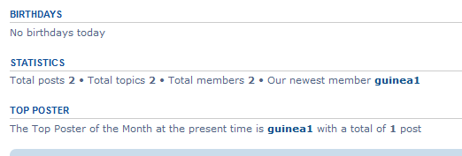
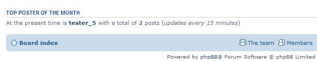

# tpotm
[](https://travis-ci.org/3D-I/tpotm)

Top Poster of the month is an extension that requires at least phpBB version 3.1.8, works also on 3.2.x.
This is a port of the MOD I made first for phpBB2 and for phpBB3 (Olympus) then.

Have a Top Poster of the Month to show on your phpBB except for Founder, Banned, Admins and Moderators. The last poster with the max number of posts made into the current month's gap of time will win. Cached data management is in the ACP, works according with the - who is online time span - (native). The TPOTM's profile link works according with the - can view profile - permissions (native).

No Top Poster


Top Poster with 1 post


Top Poster with 2 or more posts


## Installation

### 1. clone
Clone (or download and move) the repository into the folder ext/threedi/tpotm:

```
cd phpBB3
git clone https://github.com/3D-I/tpotm.git ext/threedi/tpotm/
```

### 2. activate
Go to admin panel -> tab Customise -> Manage extensions -> Top Poster Of The Month: enable

## Update instructions:
1. Go to you phpBB-Board > Admin Control Panel > Customise > Manage extensions > Top Poster Of The Month: disable
2. Delete all files of the extension from ext/threedi/tpotm
3. Upload all the new files to the same locations
4. Go to you phpBB-Board > Admin Control Panel > Customise > Manage extensions > Top Poster Of The Month: enable
